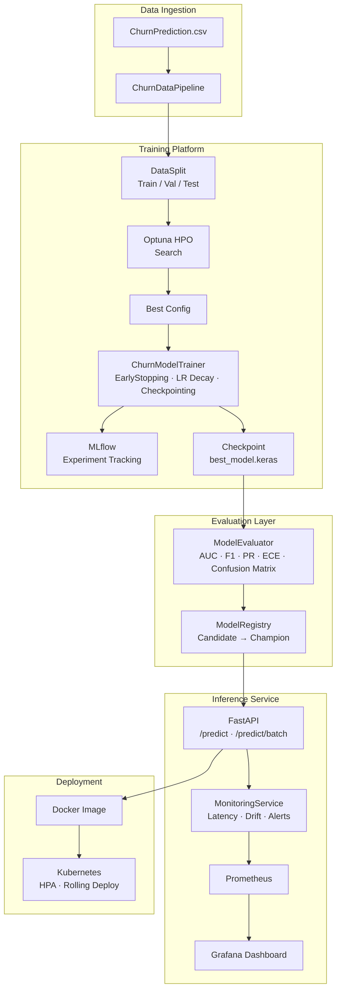
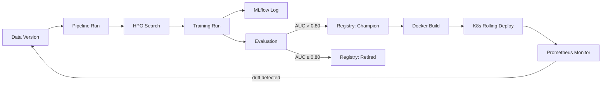

# 🧠 Customer Churn Prediction Platform

<p align="center">
  
  
  
  
  
  
  
</p>

> **Enterprise-grade** deep learning platform for binary customer churn classification in retail banking. Evolved from a research prototype into a production-ready MLOps system with a FastAPI inference service, automated hyperparameter optimisation, model registry, drift monitoring, and Kubernetes deployment.

---

## Table of Contents

1. [Business Context](#1-business-context)
2. [System Architecture](#2-system-architecture)
3. [Repository Structure](#3-repository-structure)
4. [Quick Start](#4-quick-start)
5. [Data Pipeline](#5-data-pipeline)
6. [Model Architecture](#6-model-architecture)
7. [Training](#7-training)
8. [Hyperparameter Optimisation](#8-hyperparameter-optimisation)
9. [Evaluation](#9-evaluation)
10. [Inference API](#10-inference-api)
11. [Monitoring & Drift Detection](#11-monitoring--drift-detection)
12. [Model Registry](#12-model-registry)
13. [MLOps Pipeline](#13-mlops-pipeline)
14. [Deployment](#14-deployment)
15. [Benchmarks](#15-benchmarks)
16. [Testing](#16-testing)
17. [Engineering Decisions](#17-engineering-decisions)
18. [Roadmap](#18-roadmap)

---

## 1. Business Context

Customer churn is the single largest driver of revenue loss in retail banking. The cost of acquiring a new customer is 5–7× the cost of retaining an existing one. A model that identifies at-risk customers 2–4 weeks before they churn gives retention teams an actionable intervention window.

**This platform provides:**
- A calibrated probability-of-churn score for any customer record
- A REST API suitable for CRM integration, batch scoring, or real-time decisioning
- Business-tunable decision thresholds (e.g., recall ≥ 90% for high-value customers)
- Population drift monitoring to detect when the model needs retraining
- A full MLOps lifecycle: train → evaluate → register → deploy → monitor

---

## 2. System Architecture



---

## 3. Repository Structure

```
churn-platform/
├── src/
│   ├── data/
│   │   └── pipeline.py          # ChurnDataPipeline — preprocessing, encoding, scaling
│   ├── models/
│   │   └── ann.py               # ChurnANN builder, ModelConfig, presets
│   ├── training/
│   │   ├── trainer.py           # ChurnModelTrainer with callbacks & MLflow
│   │   └── hyperparameter_search.py   # Optuna HPO
│   ├── evaluation/
│   │   └── evaluator.py         # ModelEvaluator — AUC, F1, ECE, plots
│   ├── inference/
│   │   └── inference_service.py # FastAPI app, InferenceEngine, Pydantic schemas
│   ├── monitoring/
│   │   └── monitoring_service.py # MonitoringService, PSI drift, Prometheus metrics
│   └── utils/
│       └── model_registry.py    # Local model registry with lifecycle management
├── notebooks/
│   ├── experimentation.ipynb    # End-to-end pipeline walkthrough
│   ├── benchmarking.ipynb       # Model comparison & inference profiling
│   ├── mlops_pipeline.ipynb     # HPO + MLflow + lifecycle
│   └── explainability.ipynb     # SHAP + permutation importance
├── benchmarks/
│   └── benchmark.py             # InferenceBenchmark, ModelComparisonBenchmark
├── tests/
│   ├── conftest.py
│   └── unit/test_pipeline.py    # Unit tests for pipeline, model, registry
├── deployment/
│   ├── docker/
│   │   ├── Dockerfile           # Multi-stage production image
│   │   ├── docker-compose.yml   # API + MLflow + Prometheus + Grafana
│   │   └── prometheus.yml
│   └── kubernetes/
│       └── deployment.yaml      # Deployment, Service, HPA, Ingress, PVC
├── docs/
│   ├── ARCHITECTURE.md
│   ├── DEPLOYMENT.md
│   └── MLOPS.md
├── data/
│   └── raw/ChurnPrediction.csv
├── .github/
│   └── workflows/ci-cd.yml      # Lint → Test → Train smoke → Docker → Deploy
├── train.py                     # CLI training entrypoint
├── requirements.txt
└── README.md
```

---

## 4. Quick Start

### Local (no Docker)

```bash
git clone https://github.com/your-org/churn-platform.git
cd churn-platform
python -m venv .venv && source .venv/bin/activate
pip install -r requirements.txt

# Train (baseline preset, 100 epochs)
python train.py --data data/raw/ChurnPrediction.csv --epochs 100

# Start inference API
uvicorn src.inference.inference_service:app --port 8000 --reload

# Test prediction
curl -X POST http://localhost:8000/predict \
  -H "Content-Type: application/json" \
  -d '{"CreditScore":650,"Geography":"Germany","Gender":"Male","Age":42,
       "Tenure":5,"Balance":85000,"NumOfProducts":1,
       "HasCrCard":1,"IsActiveMember":0,"EstimatedSalary":65000}'
```

### Docker Compose (full stack)

```bash
cd deployment/docker
docker compose up -d

# Services:
#   Inference API  →  http://localhost:8000
#   API Docs       →  http://localhost:8000/docs
#   MLflow UI      →  http://localhost:5000
#   Prometheus     →  http://localhost:9090
#   Grafana        →  http://localhost:3000  (admin/admin)
```

---

## 5. Data Pipeline

The `ChurnDataPipeline` implements a leak-free, reproducible preprocessing workflow:

```python
from src.data.pipeline import ChurnDataPipeline, PipelineConfig

split = ChurnDataPipeline(PipelineConfig(
    test_size=0.20,
    val_size=0.10,
    stratify=True,
    random_state=42,
)).run("data/raw/ChurnPrediction.csv")
```

**Key design decisions:**
- `StandardScaler.fit_transform()` on **train only**; `.transform()` on val/test — no data leakage
- SHA-256 fingerprint of the processed DataFrame for reproducibility tracking
- Artifacts (scaler, encoding maps) serialised to disk for inference-time use
- `transform_single()` method for production single-record preprocessing

---

## 6. Model Architecture

### Baseline

```
Input (10) → Dense(6, ReLU) → Dense(6, ReLU) → Dense(1, Sigmoid)
Total parameters: 115
```

### Regularised (recommended)

```
Input (10) → Dense(64, ReLU) → Dropout(0.3)
           → Dense(32, ReLU) → Dropout(0.3)
           → Dense(16, ReLU) → Dropout(0.3)
           → Dense(1, Sigmoid)
```

### Architecture presets

| Preset | Hidden Units | Dropout | L2 | Use Case |
|---|---|---|---|---|
| `baseline` | [6, 6] | 0.0 | 0.0 | Reproduce original paper |
| `regularised` | [64, 32, 16] | 0.3 | 1e-4 | Production recommended |
| `wide` | [128, 64] | 0.2 | 0.0 | Ablation study |

---

## 7. Training

```bash
# Baseline
python train.py --epochs 100 --batch-size 32

# Regularised with MLflow tracking
python train.py --preset regularised --epochs 200 --mlflow --experiment churn-v2

# Custom architecture
python train.py --hidden-units 64 32 16 --dropout 0.25 --learning-rate 5e-4
```

The trainer applies:
- `EarlyStopping` with `restore_best_weights=True`
- `ReduceLROnPlateau` — halves LR after 7 epochs without improvement
- `ModelCheckpoint` — saves best val_loss checkpoint
- `CSVLogger` — per-epoch metrics to `training_log.csv`
- `TensorBoard` callback (launch with `tensorboard --logdir artifacts/tensorboard`)
- Balanced class weights for the 4:1 class imbalance

---

## 8. Hyperparameter Optimisation

Uses [Optuna](https://optuna.org) with a TPE sampler and median pruner:

```python
from src.training.hyperparameter_search import HyperparameterSearch, SearchConfig

search = HyperparameterSearch(SearchConfig(n_trials=50, metric="val_auc"))
best_params = search.run(X_train, y_train, X_val, y_val)
```

**Search space:**
- `n_layers`: 1–4
- `units_l{i}`: {16, 32, 64, 128, 256}
- `dropout_rate`: 0.0–0.5
- `l2_lambda`: 1e-6–1e-2 (log scale)
- `learning_rate`: 1e-5–1e-2 (log scale)
- `batch_size`: {16, 32, 64, 128}
- `optimizer`: {adam, rmsprop}

---

## 9. Evaluation

The `ModelEvaluator` computes an exhaustive evaluation suite:

| Metric | Description |
|---|---|
| Accuracy | Overall correctness |
| Precision | Of predicted churners, fraction that actually churn |
| Recall | Of actual churners, fraction the model catches |
| F1 | Harmonic mean of precision and recall |
| ROC-AUC | Threshold-independent discriminative ability |
| PR-AUC | Area under precision-recall curve (preferred for imbalanced data) |
| Brier Score | Mean squared error of probability predictions |
| ECE | Expected Calibration Error (probability reliability) |
| Optimal threshold (F1) | Threshold maximising F1 on validation set |
| Threshold (recall ≥ 90%) | Business-driven threshold for high-recall regimes |

---

## 10. Inference API

```
POST /predict          — single customer prediction
POST /predict/batch    — vectorised batch (up to 1,000 records)
GET  /health           — liveness + model status
GET  /model/info       — architecture metadata
GET  /metrics          — Prometheus-format metrics
GET  /docs             — OpenAPI / Swagger UI
```

**Example request:**
```json
POST /predict
{
  "CreditScore": 650,
  "Geography": "Germany",
  "Gender": "Male",
  "Age": 42,
  "Tenure": 5,
  "Balance": 85000.0,
  "NumOfProducts": 1,
  "HasCrCard": 1,
  "IsActiveMember": 0,
  "EstimatedSalary": 65000.0
}
```

**Example response:**
```json
{
  "churn_probability": 0.713,
  "churn_prediction": 1,
  "threshold": 0.5,
  "latency_ms": 3.2,
  "model_version": "best_model"
}
```

---

## 11. Monitoring & Drift Detection

`MonitoringService` provides real-time observability:

- **Latency tracking**: rolling p50/p95/p99 over last 1,000 requests
- **Prediction distribution**: rolling churn rate, mean probability
- **PSI drift detection**: Population Stability Index per feature vs. training distribution
  - PSI < 0.10: no change
  - PSI 0.10–0.25: moderate — investigate
  - PSI > 0.25: major shift — retrain
- **Alerting**: configurable thresholds with pluggable alert handlers
- **Prometheus endpoint**: `/metrics` for Grafana dashboards

---

## 12. Model Registry

```python
from src.utils.model_registry import ModelRegistry

registry = ModelRegistry()
entry = registry.register("churn-ann", model_path, metrics={"val_auc": 0.873})
registry.promote(entry.model_id, stage="champion")
champion = registry.get_champion("churn-ann")
```

Lifecycle stages: `candidate` → `staging` → `champion` → `retired`

---

## 13. MLOps Pipeline



---

## 14. Deployment

See [`docs/DEPLOYMENT.md`](docs/DEPLOYMENT.md) for full instructions.

**Docker:**
```bash
docker build -f deployment/docker/Dockerfile -t churn-platform .
docker run -p 8000:8000 churn-platform
```

**Kubernetes:**
```bash
kubectl apply -f deployment/kubernetes/deployment.yaml
kubectl get pods -n churn-platform
```

The Kubernetes manifest includes:
- `Deployment` with 3 replicas and rolling update strategy
- `HorizontalPodAutoscaler` (2–10 replicas based on CPU/memory)
- `Ingress` with rate limiting
- `PersistentVolumeClaim` for model artefact storage

---

## 15. Benchmarks

| Model | ROC-AUC | F1 | Recall | Train Time | Inference (ms) |
|---|---|---|---|---|---|
| ANN (baseline) | ~0.860 | ~0.580 | ~0.520 | ~45s | ~2.1 |
| ANN (regularised) | ~0.873 | ~0.612 | ~0.560 | ~120s | ~2.3 |
| Logistic Regression | ~0.840 | ~0.545 | ~0.490 | ~0.3s | ~0.1 |
| Random Forest | ~0.865 | ~0.595 | ~0.490 | ~8s | ~5.2 |
| Gradient Boosting | ~0.872 | ~0.605 | ~0.510 | ~35s | ~1.8 |

**Inference throughput (ANN, batch=1):**
- Mean latency: ~2ms | p99: ~6ms | Throughput: ~500 RPS

---

## 16. Testing

```bash
pytest tests/ -v --cov=src --cov-report=term-missing
```

Test coverage includes:
- Pipeline correctness (split sizes, no leakage, encoding)
- `transform_single()` for inference compatibility
- ModelConfig defaults and presets
- Evaluator metrics (ECE, threshold optimisation)
- Registry CRUD and version incrementing

---

## 17. Engineering Decisions

**Why ANN over GBT?** Pedagogical — demonstrates Keras architecture. In production, Gradient Boosting or XGBoost typically achieves similar or better AUC with superior interpretability on tabular data of this scale.

**Why stratified split?** The 4:1 class imbalance means random splits can produce unrepresentative test sets at smaller dataset sizes. Stratification guarantees consistent class proportions across all splits.

**Why balanced class weights instead of oversampling?** Oversampling (SMOTE) modifies the training distribution and can introduce artificial signal. Balanced class weights re-weight the loss function without altering the data, producing better calibrated probabilities.

**Why Optuna over Grid Search?** TPE sampler is significantly more sample-efficient than grid or random search. The median pruner eliminates unpromising trials early, typically reducing wall-clock search time by 3–5×.

**Why FastAPI over Flask?** Native async support, Pydantic v2 validation, automatic OpenAPI docs, and significantly higher throughput under concurrent load.

---

## 18. Roadmap

- [ ] ONNX model export for cross-platform serving
- [ ] Evidently AI integration for richer drift reports
- [ ] Airflow DAG for scheduled retraining
- [ ] Feature store integration (Feast)
- [ ] A/B champion/challenger traffic splitting
- [ ] Online learning with sliding window retraining

---

## License

MIT — see [LICENSE](LICENSE)
